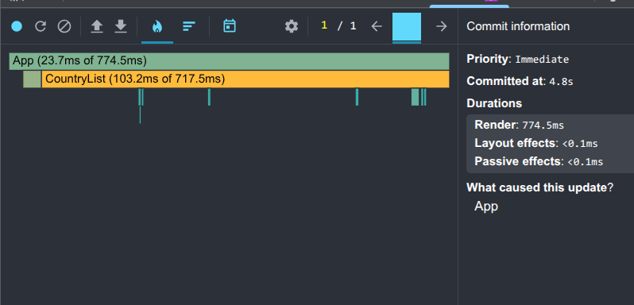
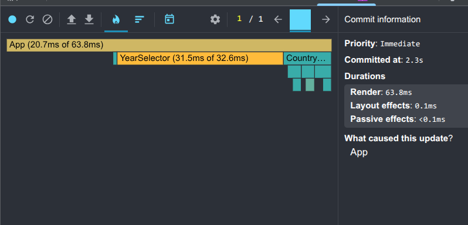
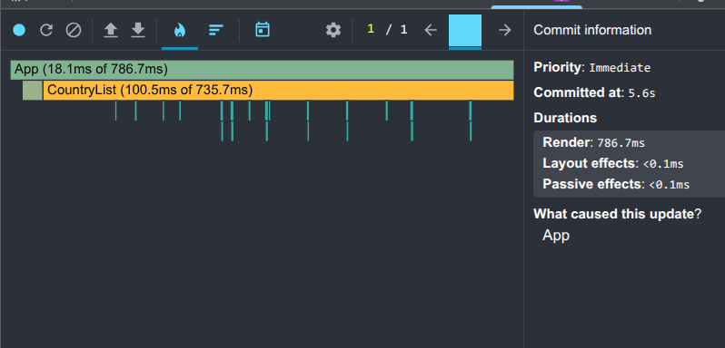
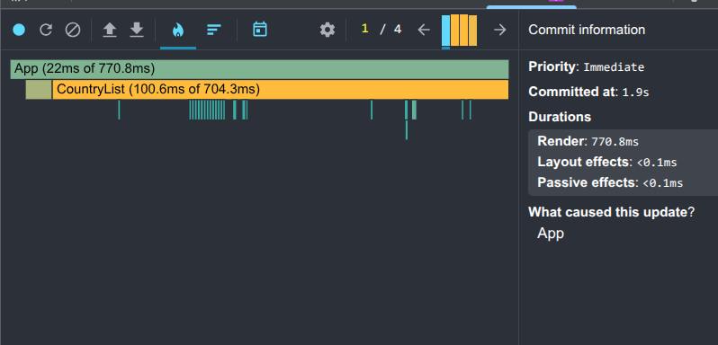
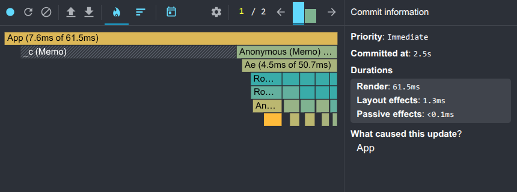
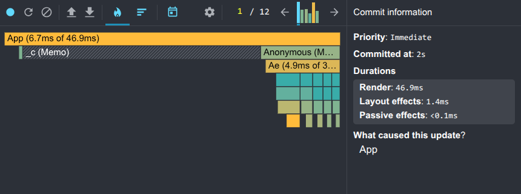
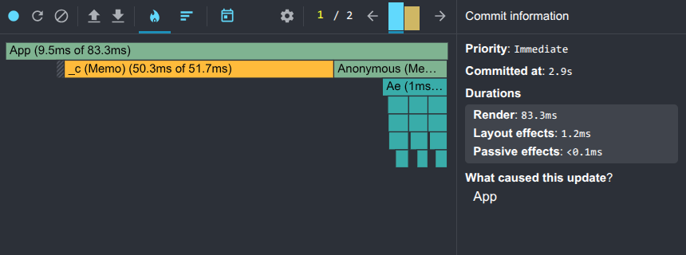
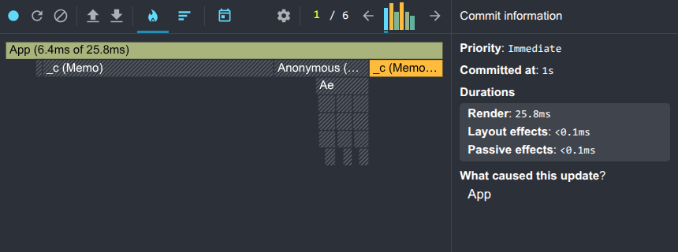

# Performance Optimization Report

## Baseline Measurements

### Interaction A: Sort countries

- **Commit duration**: 4.8 s
- **Render duration**: 774.5 ms
- **Screenshot**: 

### Interaction B: Search countries

- **Commit duration**: 2.3 s
- **Render duration**: 63.8 ms
- **Screenshot**: 

### Interaction C: Change year

- **Commit duration**: 5.6 s
- **Render duration**: 786.7 ms
- **Screenshot**: 

### Interaction D: Toggle column

- **Commit duration**: 1.9 s
- **Render duration**: 770.8 ms
- **Screenshot**: 

---

## Optimized Measurements

### Interaction A: Sort countries

- **Commit duration**: 2.5 s
- **Render duration**: 61.5 ms
- **Screenshot**: 

### Interaction B: Search countries

- **Commit duration**: 2 s
- **Render duration**: 46.9 ms
- **Screenshot**: 

### Interaction C: Change year

- **Commit duration**: 2.9 s
- **Render duration**: 83 ms
- **Screenshot**: 

### Interaction D: Toggle column

- **Commit duration**: 1 s
- **Render duration**: 25.8 ms
- **Screenshot**: 

---

## Summary of Improvements

| Interaction      | Baseline (ms) | Optimized (ms) | Improvement |
| ---------------- | ------------- | -------------- | ----------- |
| Sort countries   | 774.5         | 61.5           | 92.1%       |
| Search countries | 63.8          | 46.9           | 26.5%       |
| Change year      | 786.7         | 83             | 89.4%       |
| Toggle column    | 770.8         | 25.8           | 96.7%       |
| **Average**      | **599.0**     | **54.3**       | **76.2%**   |

---
